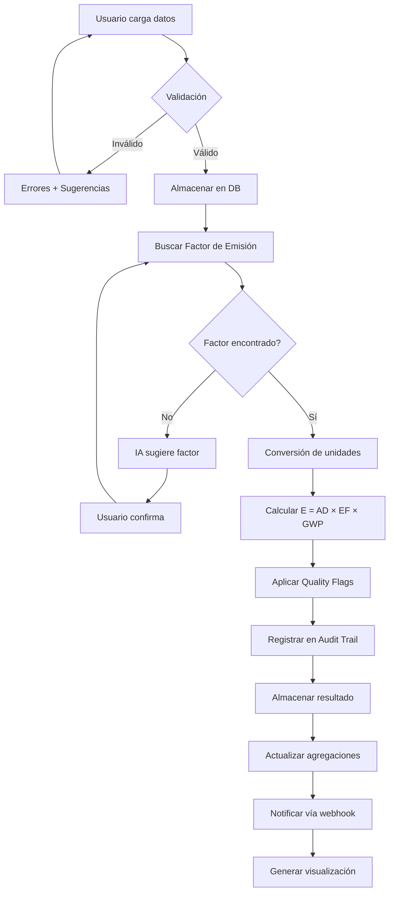

# 🏗️ ARQUITECTURA TÉCNICA AVANZADA
## Sistema Profesional de Medición de Huella de Carbono

---

## 📐 ARQUITECTURA PROPUESTA (Microservicios)

```
┌─────────────────────────────────────────────────────────────────┐
│                        FRONTEND LAYER                           │
├─────────────────────────────────────────────────────────────────┤
│                                                                 │
│  ┌──────────────┐  ┌──────────────┐  ┌──────────────┐         │
│  │   Streamlit  │  │  React SPA   │  │  Mobile App  │         │
│  │   Dashboard  │  │   (Admin)    │  │ (React Native)│        │
│  └──────────────┘  └──────────────┘  └──────────────┘         │
│         │                  │                  │                 │
└─────────┼──────────────────┼──────────────────┼─────────────────┘
          │                  │                  │
          └──────────────────┴──────────────────┘
                             │
                    ┌────────▼─────────┐
                    │   API Gateway    │
                    │  (FastAPI/Kong)  │
                    └────────┬─────────┘
                             │
        ┌────────────────────┼────────────────────┐
        │                    │                    │
┌───────▼────────┐  ┌───────▼────────┐  ┌───────▼────────┐
│  Calculation   │  │   Data Mgmt    │  │   AI Service   │
│    Service     │  │    Service     │  │    (Ollama)    │
├────────────────┤  ├────────────────┤  ├────────────────┤
│ • Core calc    │  │ • Validation   │  │ • Category map │
│ • Scope 1/2/3  │  │ • Import/Export│  │ • Semantic     │
│ • Aggregation  │  │ • Quality check│  │ • Recommend    │
│ • Unit convert │  │ • Audit trail  │  │ • Forecast     │
└────────┬───────┘  └────────┬───────┘  └────────┬───────┘
         │                   │                   │
         └───────────────────┴───────────────────┘
                             │
                    ┌────────▼─────────┐
                    │   Message Bus    │
                    │  (RabbitMQ/Kafka)│
                    └────────┬─────────┘
                             │
        ┌────────────────────┼────────────────────┐
        │                    │                    │
┌───────▼────────┐  ┌───────▼────────┐  ┌───────▼────────┐
│   PostgreSQL   │  │     Redis      │  │   MinIO/S3     │
│  (Main DB)     │  │    (Cache)     │  │  (File Store)  │
├────────────────┤  ├────────────────┤  ├────────────────┤
│ • Activities   │  │ • Session      │  │ • Uploads      │
│ • Results      │  │ • Factors      │  │ • Reports      │
│ • Users        │  │ • Metrics      │  │ • Backups      │
│ • Audit logs   │  │ • Real-time    │  │ • Documents    │
└────────────────┘  └────────────────┘  └────────────────┘
```

---

## 🗄️ MODELO DE DATOS AVANZADO

### Schema PostgreSQL:

```sql
-- Organizaciones y usuarios
CREATE TABLE organizations (
    id UUID PRIMARY KEY DEFAULT gen_random_uuid(),
    name VARCHAR(255) NOT NULL,
    industry VARCHAR(100),
    country_code CHAR(3),
    baseline_year INT,
    baseline_emissions DECIMAL(12,3),
    target_year INT,
    target_reduction_pct DECIMAL(5,2),
    created_at TIMESTAMP DEFAULT NOW(),
    updated_at TIMESTAMP DEFAULT NOW()
);

CREATE TABLE sites (
    id UUID PRIMARY KEY DEFAULT gen_random_uuid(),
    organization_id UUID REFERENCES organizations(id),
    name VARCHAR(255) NOT NULL,
    location VARCHAR(255),
    site_type VARCHAR(50),  -- factory, office, warehouse
    latitude DECIMAL(10,8),
    longitude DECIMAL(11,8),
    created_at TIMESTAMP DEFAULT NOW()
);

CREATE TABLE users (
    id UUID PRIMARY KEY DEFAULT gen_random_uuid(),
    email VARCHAR(255) UNIQUE NOT NULL,
    organization_id UUID REFERENCES organizations(id),
    role VARCHAR(50),  -- admin, analyst, viewer, auditor
    created_at TIMESTAMP DEFAULT NOW(),
    last_login TIMESTAMP
);

-- Actividades y emisiones
CREATE TABLE activity_records (
    id UUID PRIMARY KEY DEFAULT gen_random_uuid(),
    organization_id UUID REFERENCES organizations(id),
    site_id UUID REFERENCES sites(id),
    entity_id VARCHAR(100) NOT NULL,
    scope INT NOT NULL CHECK (scope IN (1,2,3)),
    category VARCHAR(100) NOT NULL,
    subcategory VARCHAR(100),
    activity_value DECIMAL(15,3) NOT NULL,
    activity_unit VARCHAR(50) NOT NULL,
    activity_date DATE NOT NULL,
    fiscal_year INT NOT NULL,
    period VARCHAR(10),  -- Q1, Q2, Q3, Q4 o mes
    geography VARCHAR(10),
    description TEXT,
    data_quality VARCHAR(20),  -- TIER_1, TIER_2, TIER_3
    source_document VARCHAR(255),
    created_by UUID REFERENCES users(id),
    created_at TIMESTAMP DEFAULT NOW(),
    updated_at TIMESTAMP DEFAULT NOW()
);

CREATE TABLE emission_results (
    id UUID PRIMARY KEY DEFAULT gen_random_uuid(),
    activity_id UUID REFERENCES activity_records(id),
    emission_factor_id UUID REFERENCES emission_factors(id),
    emission_kg_co2e DECIMAL(15,3) NOT NULL,
    emission_tco2e DECIMAL(12,3) NOT NULL,
    calculation_formula TEXT,
    conversion_notes TEXT,
    quality_flags JSONB,
    calculated_at TIMESTAMP DEFAULT NOW(),
    calculated_by UUID REFERENCES users(id)
);

CREATE TABLE emission_factors (
    id UUID PRIMARY KEY DEFAULT gen_random_uuid(),
    source VARCHAR(50) NOT NULL,  -- UK2025, EPA2024, IPCC2019
    source_version VARCHAR(50),
    gas VARCHAR(20) NOT NULL,
    value DECIMAL(15,6) NOT NULL,
    unit VARCHAR(100) NOT NULL,
    year INT NOT NULL,
    geography VARCHAR(10),
    scope INT CHECK (scope IN (1,2,3)),
    category VARCHAR(100),
    subcategory VARCHAR(100),
    description TEXT,
    url TEXT,
    valid_from DATE,
    valid_to DATE,
    created_at TIMESTAMP DEFAULT NOW()
);

-- Auditoría y trazabilidad
CREATE TABLE audit_trail (
    id UUID PRIMARY KEY DEFAULT gen_random_uuid(),
    user_id UUID REFERENCES users(id),
    action VARCHAR(50) NOT NULL,  -- CREATE, UPDATE, DELETE, CALCULATE
    entity_type VARCHAR(50),  -- activity, result, factor
    entity_id UUID,
    old_value JSONB,
    new_value JSONB,
    ip_address INET,
    user_agent TEXT,
    created_at TIMESTAMP DEFAULT NOW()
);

-- Objetivos y metas
CREATE TABLE climate_targets (
    id UUID PRIMARY KEY DEFAULT gen_random_uuid(),
    organization_id UUID REFERENCES organizations(id),
    target_type VARCHAR(50),  -- SBTi, Net_Zero, Custom
    baseline_year INT NOT NULL,
    baseline_emissions DECIMAL(12,3) NOT NULL,
    target_year INT NOT NULL,
    target_emissions DECIMAL(12,3),
    reduction_percentage DECIMAL(5,2),
    scope_coverage VARCHAR(20),  -- Scope_1_2, Scope_1_2_3
    verified BOOLEAN DEFAULT FALSE,
    verification_body VARCHAR(100),
    created_at TIMESTAMP DEFAULT NOW()
);

CREATE TABLE emissions_tracking (
    id UUID PRIMARY KEY DEFAULT gen_random_uuid(),
    organization_id UUID REFERENCES organizations(id),
    fiscal_year INT NOT NULL,
    period VARCHAR(10),
    scope_1_emissions DECIMAL(12,3),
    scope_2_location DECIMAL(12,3),
    scope_2_market DECIMAL(12,3),
    scope_3_emissions DECIMAL(12,3),
    total_emissions DECIMAL(12,3),
    data_quality_score DECIMAL(3,2),  -- 0.00 - 1.00
    completeness_pct DECIMAL(5,2),
    created_at TIMESTAMP DEFAULT NOW()
);

-- Índices para performance
CREATE INDEX idx_activity_org_date ON activity_records(organization_id, activity_date);
CREATE INDEX idx_activity_scope ON activity_records(scope);
CREATE INDEX idx_results_activity ON emission_results(activity_id);
CREATE INDEX idx_factors_source_year ON emission_factors(source, year);
CREATE INDEX idx_audit_user_date ON audit_trail(user_id, created_at);
```

---

## 🔄 PROCESOS Y FLUJOS

### Flujo de Cálculo de Emisiones:



### Flujo de IA para Categorización:

```python
# Pseudo-código del flujo
def ai_categorization_flow(user_input: str):
    """
    1. Usuario ingresa descripción natural
    2. IA analiza con contexto de GHG Protocol
    3. Genera sugerencia con confianza
    4. Usuario confirma o corrige
    5. Sistema aprende de correcciones
    """
    
    # Paso 1: Análisis con LLM
    ai_suggestion = ollama_client.categorize(
        description=user_input,
        context=ghg_protocol_context,
        examples=few_shot_examples
    )
    
    # Paso 2: Validación contra catálogo
    validated = validate_against_catalog(ai_suggestion)
    
    # Paso 3: Presentar al usuario con confianza
    if validated.confidence > 0.9:
        status = "high_confidence"
    elif validated.confidence > 0.7:
        status = "medium_confidence"
    else:
        status = "low_confidence"
    
    # Paso 4: Feedback loop
    user_feedback = get_user_confirmation(validated, status)
    
    if user_feedback.corrected:
        # Almacenar para fine-tuning
        store_correction(
            input=user_input,
            ai_output=ai_suggestion,
            correct_output=user_feedback.corrected_category
        )
    
    return validated
```

---

## 🧪 TESTS Y CALIDAD

### Estructura de Tests Avanzada:

```python
# tests/test_suite.py
import pytest
from decimal import Decimal

class TestEmissionCalculations:
    """Tests de cálculos de emisiones"""
    
    @pytest.mark.parametrize("activity,ef,expected", [
        (100, 2.68, 268.0),
        (1000, 0.185, 185.0),
        (50.5, 3.14159, 158.65)
    ])
    def test_basic_calculation(self, activity, ef, expected):
        result = compute_emission(activity, ef)
        assert abs(result - expected) < 0.01
    
    def test_unit_conversion(self):
        """Test conversión automática de unidades"""
        result = convert_unit(100, 'kWh', 'MJ')
        assert result == 360.0
    
    def test_gwp_application(self):
        """Test aplicación de GWP"""
        ch4_emission = compute_emission_with_gwp(
            activity=10,  # kg CH4
            ef=1.0,
            gas='CH4'
        )
        assert ch4_emission == 280  # 10 kg CH4 × GWP28 = 280 kg CO2e

class TestDataValidation:
    """Tests de validación de datos"""
    
    def test_scope_validation(self):
        """Scope debe ser 1, 2 o 3"""
        with pytest.raises(ValidationError):
            ActivityRecord(scope=4, ...)
    
    def test_negative_values(self):
        """Valores negativos deben rechazarse"""
        with pytest.raises(ValidationError):
            ActivityRecord(activity_value=-100, ...)
    
    def test_invalid_units(self):
        """Unidades inválidas deben detectarse"""
        result = validate_unit('invalid_unit')
        assert result.is_valid == False

class TestAIComponents:
    """Tests de componentes de IA"""
    
    @pytest.fixture
    def ai_mapper(self):
        return GHGCategoryMapper(model='llama3.2:3b')
    
    def test_category_mapping(self, ai_mapper):
        """Test mapeo de categorías con IA"""
        result = ai_mapper.map_activity(
            "consumo de diesel en tractores agrícolas"
        )
        assert result['scope'] == 1
        assert result['category'] == 'mobile_combustion'
        assert result['confidence'] > 0.8
    
    @pytest.mark.slow
    def test_semantic_search(self):
        """Test búsqueda semántica de factores"""
        results = semantic_search.find_factors(
            query="transporte marítimo de contenedores"
        )
        assert len(results) > 0
        assert 'freight' in results[0].category.lower()

class TestIntegrations:
    """Tests de integraciones"""
    
    @pytest.mark.integration
    def test_api_endpoint(self, test_client):
        """Test endpoint de API"""
        response = test_client.post('/api/v1/calculate', json={
            'entity_id': 'test',
            'scope': 1,
            'category': 'diesel',
            'activity_value': 100,
            'activity_unit': 'liters'
        })
        assert response.status_code == 200
        assert 'emission_tco2e' in response.json()
    
    @pytest.mark.integration
    def test_database_connection(self, db_session):
        """Test conexión a base de datos"""
        record = ActivityRecord.query.first()
        assert record is not None

# Cobertura objetivo: >90%
# Comando: pytest --cov=. --cov-report=html tests/
```

### CI/CD Pipeline Completo:

```yaml
# .github/workflows/ci-cd.yml
name: CI/CD Pipeline

on:
  push:
    branches: [main, develop]
  pull_request:
    branches: [main]

jobs:
  test:
    runs-on: ubuntu-latest
    
    services:
      postgres:
        image: postgres:15
        env:
          POSTGRES_PASSWORD: test
        options: >-
          --health-cmd pg_isready
          --health-interval 10s
          --health-timeout 5s
          --health-retries 5
      
      redis:
        image: redis:7
        options: >-
          --health-cmd "redis-cli ping"
    
    steps:
      - uses: actions/checkout@v3
      
      - name: Set up Python
        uses: actions/setup-python@v4
        with:
          python-version: '3.11'
      
      - name: Install dependencies
        run: |
          pip install -r requirements.txt
          pip install pytest pytest-cov
      
      - name: Run tests
        run: |
          pytest --cov=. --cov-report=xml --cov-report=html
      
      - name: Upload coverage
        uses: codecov/codecov-action@v3
        with:
          file: ./coverage.xml
      
      - name: Lint with flake8
        run: |
          pip install flake8
          flake8 . --count --select=E9,F63,F7,F82 --show-source
      
      - name: Type checking with mypy
        run: |
          pip install mypy
          mypy --ignore-missing-imports .

  security:
    runs-on: ubuntu-latest
    steps:
      - uses: actions/checkout@v3
      
      - name: Run Bandit security scan
        run: |
          pip install bandit
          bandit -r . -f json -o bandit-report.json
      
      - name: Run Safety check
        run: |
          pip install safety
          safety check --json

  build:
    needs: [test, security]
    runs-on: ubuntu-latest
    steps:
      - uses: actions/checkout@v3
      
      - name: Build Docker image
        run: |
          docker build -t ghg-calculator:${{ github.sha }} .
      
      - name: Push to registry
        run: |
          echo ${{ secrets.DOCKER_PASSWORD }} | docker login -u ${{ secrets.DOCKER_USERNAME }} --password-stdin
          docker push ghg-calculator:${{ github.sha }}

  deploy:
    needs: build
    runs-on: ubuntu-latest
    if: github.ref == 'refs/heads/main'
    steps:
      - name: Deploy to production
        run: |
          # Deploy to Kubernetes/Azure/AWS
          kubectl set image deployment/ghg-calculator \
            app=ghg-calculator:${{ github.sha }}
```

---

## 🔐 SEGURIDAD Y COMPLIANCE

### Mejores Prácticas:

```python
# security/encryption.py
from cryptography.fernet import Fernet
import hashlib
import secrets

class DataEncryption:
    """Encriptación de datos sensibles"""
    
    def __init__(self):
        self.key = self._load_key()
        self.cipher = Fernet(self.key)
    
    def encrypt_sensitive_data(self, data: str) -> str:
        """Encripta datos de actividad antes de almacenar"""
        return self.cipher.encrypt(data.encode()).decode()
    
    def decrypt_sensitive_data(self, encrypted: str) -> str:
        """Desencripta para procesamiento"""
        return self.cipher.decrypt(encrypted.encode()).decode()
    
    @staticmethod
    def hash_audit_data(data: dict) -> str:
        """Hash para verificación de integridad"""
        data_str = json.dumps(data, sort_keys=True)
        return hashlib.sha256(data_str.encode()).hexdigest()

# security/rbac.py
from enum import Enum
from functools import wraps

class Permission(Enum):
    READ_DATA = "read_data"
    WRITE_DATA = "write_data"
    CALCULATE = "calculate"
    GENERATE_REPORTS = "generate_reports"
    MANAGE_USERS = "manage_users"
    AUDIT_ACCESS = "audit_access"

ROLE_PERMISSIONS = {
    'viewer': [Permission.READ_DATA],
    'analyst': [Permission.READ_DATA, Permission.WRITE_DATA, 
                Permission.CALCULATE, Permission.GENERATE_REPORTS],
    'admin': [p for p in Permission],
    'auditor': [Permission.READ_DATA, Permission.AUDIT_ACCESS]
}

def require_permission(permission: Permission):
    def decorator(func):
        @wraps(func)
        def wrapper(*args, **kwargs):
            user = get_current_user()
            if permission not in ROLE_PERMISSIONS[user.role]:
                raise PermissionDenied(f"User lacks {permission.value}")
            return func(*args, **kwargs)
        return wrapper
    return decorator

# Uso
@require_permission(Permission.CALCULATE)
def calculate_emissions(activity_id):
    pass
```

---

## 📊 MONITORING Y OBSERVABILIDAD

```python
# monitoring/metrics.py
from prometheus_client import Counter, Histogram, Gauge
import time

# Métricas de negocio
calculations_total = Counter(
    'ghg_calculations_total', 
    'Total emission calculations',
    ['scope', 'status']
)

calculation_duration = Histogram(
    'ghg_calculation_duration_seconds',
    'Time spent calculating emissions',
    ['scope']
)

total_emissions_gauge = Gauge(
    'ghg_total_emissions_tco2e',
    'Current total emissions',
    ['organization_id', 'scope']
)

# Uso en código
@calculation_duration.labels(scope=scope).time()
def compute_emission(activity, ef):
    try:
        result = activity * ef
        calculations_total.labels(scope=scope, status='success').inc()
        return result
    except Exception as e:
        calculations_total.labels(scope=scope, status='error').inc()
        raise

# monitoring/logging.py
import structlog

logger = structlog.get_logger()

logger.info(
    "emission_calculated",
    entity_id=activity.entity_id,
    scope=activity.scope,
    emission_tco2e=result.emission_tCO2e,
    user_id=current_user.id,
    duration_ms=duration
)
```

---

## 🚀 DEPLOYMENT OPTIONS

### Opción 1: Azure App Service (Más fácil)
```bash
# Deployment con Azure CLI
az webapp up \
  --name ghg-calculator \
  --resource-group rg-ghg \
  --runtime "PYTHON:3.11" \
  --sku B1
```

### Opción 2: Docker Compose (Desarrollo local)
```bash
docker-compose up -d
```

### Opción 3: Kubernetes (Producción escalable)
```bash
helm install ghg-calculator ./helm/ghg-calculator
```

### Opción 4: AWS Lambda (Serverless)
```python
# lambda_function.py
import json
from calculators.core import compute_emission

def lambda_handler(event, context):
    activity = event['activity_value']
    ef = event['emission_factor']
    
    result = compute_emission(activity, ef)
    
    return {
        'statusCode': 200,
        'body': json.dumps({
            'emission_tco2e': result.emission_tCO2e
        })
    }
```

---

## 💡 CONCLUSIÓN

Este roadmap técnico te da una visión completa de cómo escalar el proyecto desde su estado actual (MVP robusto) hasta un **sistema empresarial de clase mundial**.

**Próximos pasos sugeridos:**
1. ✅ Implementar tests adicionales (llegar a 95% coverage)
2. ✅ Dockerizar la aplicación
3. ✅ Agregar IA con Ollama para mapeo de categorías
4. ✅ Implementar API REST con FastAPI
5. ✅ Añadir PostgreSQL como base de datos principal

¿Por dónde quieres empezar? 🚀
